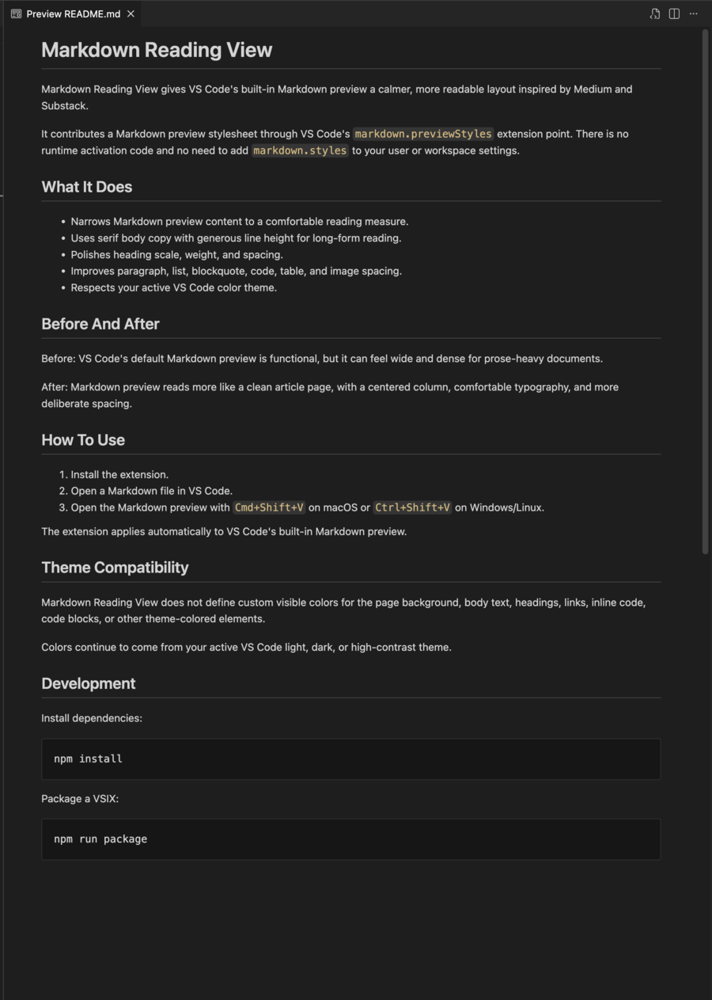
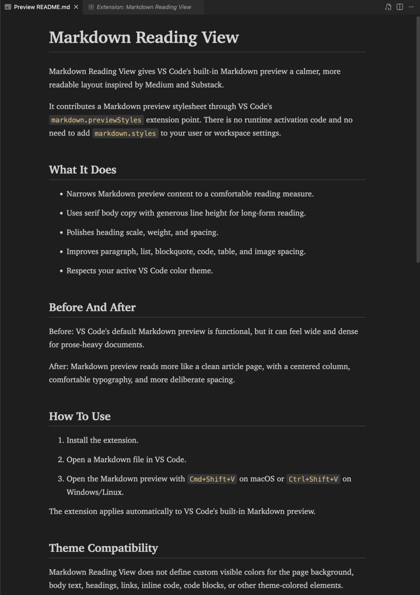

# Markdown Reading View

Markdown Reading View gives VS Code's built-in Markdown preview a calmer, more readable layout inspired by Medium and Substack.

[Install from the VS Code Marketplace](https://marketplace.visualstudio.com/items?itemName=nittarab.markdown-reading-view)

It contributes a Markdown preview stylesheet through VS Code's `markdown.previewStyles` extension point. There is no runtime activation code and no need to add `markdown.styles` to your user or workspace settings.

## What It Does

- Narrows Markdown preview content to a comfortable reading measure.
- Uses serif body copy with generous line height for long-form reading.
- Polishes heading scale, weight, and spacing.
- Improves paragraph, list, blockquote, code, table, and image spacing.
- Respects your active VS Code color theme.

## Before And After

Before: VS Code's default Markdown preview is functional, but it can feel wide and dense for prose-heavy documents.

After: Markdown preview reads more like a clean article page, with a centered column, comfortable typography, and more deliberate spacing.

<table>
  <tr>
    <th>Before</th>
    <th>After</th>
  </tr>
  <tr>
    <td></td>
    <td></td>
  </tr>
</table>

## How To Use

1. Install the extension.
2. Open a Markdown file in VS Code.
3. Open the Markdown preview with `Cmd+Shift+V` on macOS or `Ctrl+Shift+V` on Windows/Linux.

The extension applies automatically to VS Code's built-in Markdown preview.

## Theme Compatibility

Markdown Reading View does not define custom visible colors for the page background, body text, headings, links, inline code, code blocks, or other theme-colored elements.

Colors continue to come from your active VS Code light, dark, or high-contrast theme.

## Development

Install dependencies:

```sh
npm install
```

Package a VSIX:

```sh
npm run package
```
